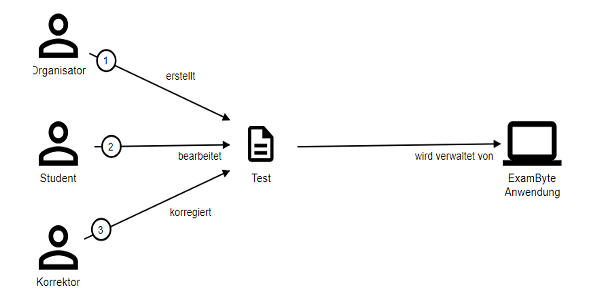
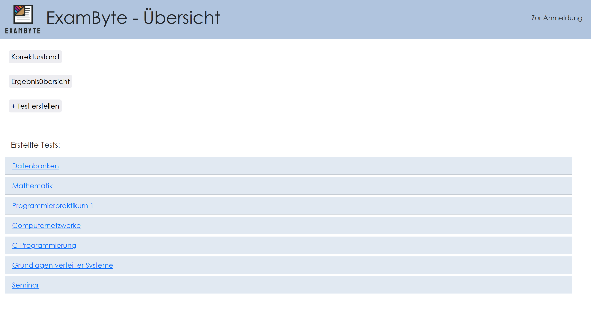
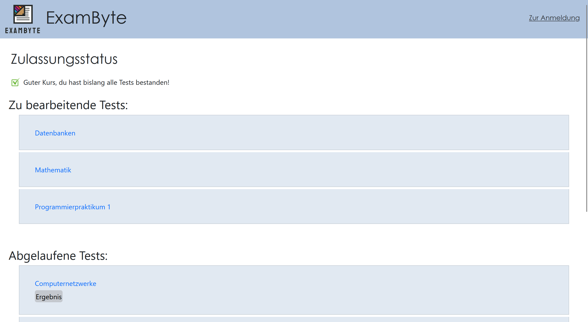
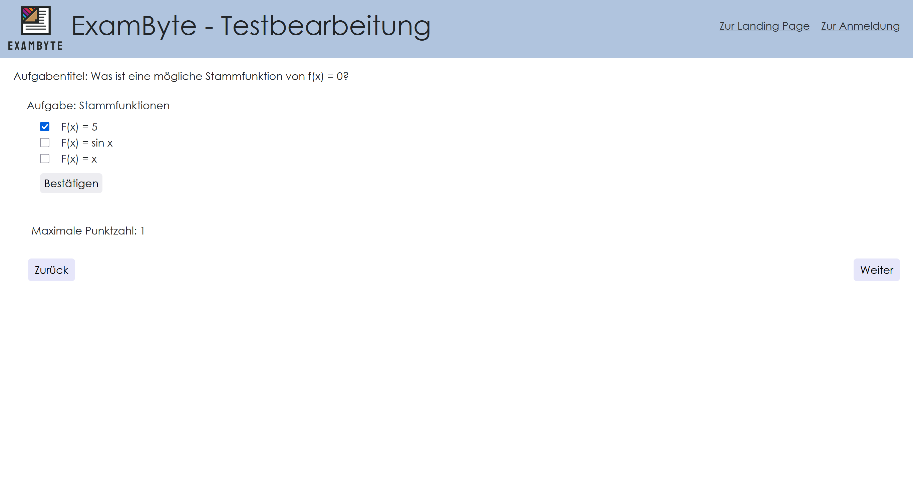
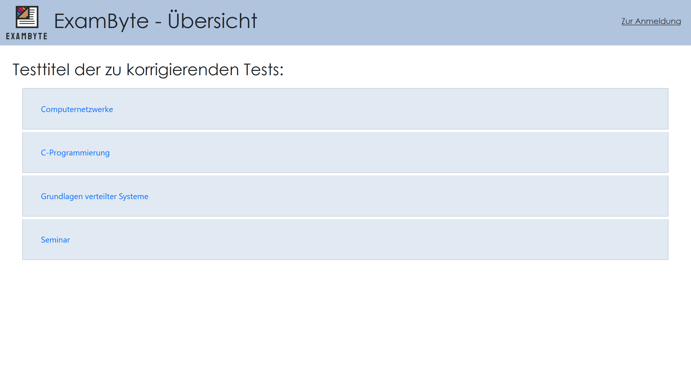
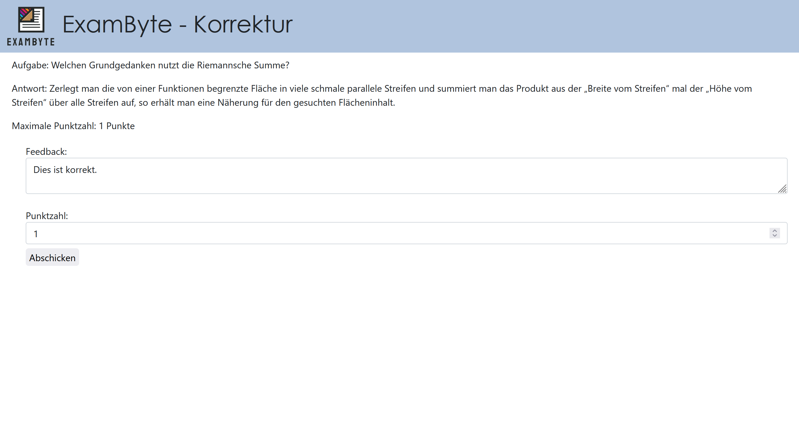

# Exambyte 
## Full-stack web application for managing exams and assessments. 

Exambyte is a web-based testing system that can be used to create, conduct, and correct tests with different question types, such as multiple choice and free text. Correction is partly manual and partly automated, and students are always informed about their current status and admission status. A key feature is role-based authentication via GitHub OAuth with a distinction between the roles of student, organizer, and corrector. This application is an improvement on ILIAS, as students are informed transparently about their admission status, while correctors and organizers are provided with various tools for general exam administration.

--- 
## Get started
Follow these steps to start the project in your local environment (e.g., WSL or Linux). 

### 1. Requirements 
* **Java 21** (JDK)
* **Docker & Docker Desktop**

**GitHub OAuth App**:
* Create a new OAuth app under [GitHub Developer Settings](https://github.com/settings/developers).
* **Homepage URL**:
  ```bash
  http://localhost:8080
  ```
* **Authorization callback URL**:
  ```bash
  http://localhost:8080
  ```
Now please generate a new Client secret, you need this and the Client Id for the next step.

### 2. Configuration (environment variables) 
We have integrated OAuth2 so that users can log in securely via GitHub. Since client secrets are sensitive, they are injected via environment variables and are not checked into the repository.
The application requires access to your GitHub app data. To do this, set the following environment variables in your terminal (or in your IDE): 
```bash
export CLIENT_ID=Your_GitHub_Client_ID 
export CLIENT_SECRET=Your_GitHub_Client_Secret
```

### 3. Role assignment 
To access protected areas after logging in, enter your GitHub username in the src/main/resources/application.yml file under the corresponding roles: 
```bash
exambyte:
  rollen:
    studenten:
      - YourGithubName
    korrektoren:
      - YourGithubName
    organisatoren:
      - YourGithubName
```
    
### 4. Start Docker 
Start the PostgreSQL database via Docker Compose: 
```bash
docker compose up -d
```

### 5. Start application 
Start the application with the Gradle wrapper: 
```bash
./gradlew bootRun
```

Once the startup process is complete, you can access the application at:
```bash
http://localhost:8080
```

--- 
## 📸 A brief look at the application

<table>
  <tr>
    <td align="center"><b>Context delimitation</b></td>
  </tr>
  <tr>
    <td></td>

  </tr>
  <tr>
    <td align="center"><b>Organisator-Page</b></td>
    <td align="center"><b>Update Test</b></td>
  </tr>
  <tr>
    <td></td>
    <td></td>
  </tr>
  <tr>
    <td align="center"><b>Studi-Page</b></td>
    <td align="center"><b>Edit test</b></td>
  </tr>
  <tr>
    <td></td>
    <td></td>
  </tr> 
 <tr>
    <td align="center"><b>Korrektor-Page</b></td>
    <td align="center"><b>Grade test</b></td>
  </tr>
  <tr>
    <td></td>
    <td></td>
  </tr> 
</table>
---

## Features 
- User authentication and authorization with OAuth2
- Role-based access control (student/grader/organizer)
- Exams with multiple-choice and free-text questions
- Comprehensive test management: create, conduct, and evaluate exams
- Automated evaluation of multiple-choice questions
- Manual evaluation of free-text questions by graders, including feedback option
- Transparent admission status display for students
- Detailed overviews for tracking correction status and exam results for organizers

---

## Tech Stack 
### Backend
- Java 21
- Spring Boot
- Spring Security (OAuth2)
- JDBC
- Flyway
- Gradle
- Deployed as a Docker container, managed with Docker Compose
- Validation

### Frontend 
- Thymeleaf
- HTML
- CSS

### Database 
- Relational SQL database (PostgreSQL)

---

## Testing Strategy
The application is tested using a comprehensive testing setup:

- **JUnit 5** for unit and integration tests
- **ArchUnit** to enforce architectural rules (Onion Architecture)
- **Spring Security Test** for authentication and authorization scenarios

Run tests locally:
```bash
./gradlew test
``` 

---

## Architecture 
The application follows the **Onion Architecture**: 
- **Domain layer** Contains the core business logic (Exams, Questions, ...) and domain models.
- **Application layer** Implements use cases and application-specific logic.
- **Presentation layer** Spring MVC Controllers and Thymeleaf templates.  
  
Dependencies refer strictly inward to keep domain logic independent and testable.
This architecture was enforced and verified using ArchUnit tests

--- 

## Background 
This project is based on a university project, whereby the tasks were set by the instructor and all implementation was carried out by [Miran](https://github.com/Narr1m) and [Kerstin](https://github.com/Kxrstin). 

--- 

## Results and experience
Exambyte represents an improvement on its predecessor ILIAS, as particular attention has been paid to creating a user-friendly interface and transparent communication of results. In addition, role-based access via OAuth2 ensures simple but secure user management.
In this project, we learned how to develop and structure a larger Java application in a test-driven manner. We implemented a web-based service with clean architecture and best practices, and learned how to integrate it into server-side user interfaces and relational database management.

---

## Images

This project uses graphics from external providers. The rights belong to the respective authors:

* **Logo (Exambyte)**: Created via [Design.com](https://www.design.com/maker/logo/creative-document-file-17357?text=ExamByte&isVariation=True)
* **Green check mark**: [iStock / Getty Images](https://www.istockphoto.com/de/vektor/h%C3%A4kchensymbol-vektor-design-vorlage-in-wei%C3%9Fem-hintergrund-gm1435212785-476685817)
* **Red cross**: [Vecteezy](https://www.vecteezy.com/vector-art/28579407-red-cross-wrong-symbol-incorrect-sign-error-in-circle)
* **Warning symbol**: [Freepik](https://www.freepik.com/premium-vector/warning-sign-with-exclamation-mark-vector-illustration-attention-symbol-information-flat-icon_129857701.htm)


